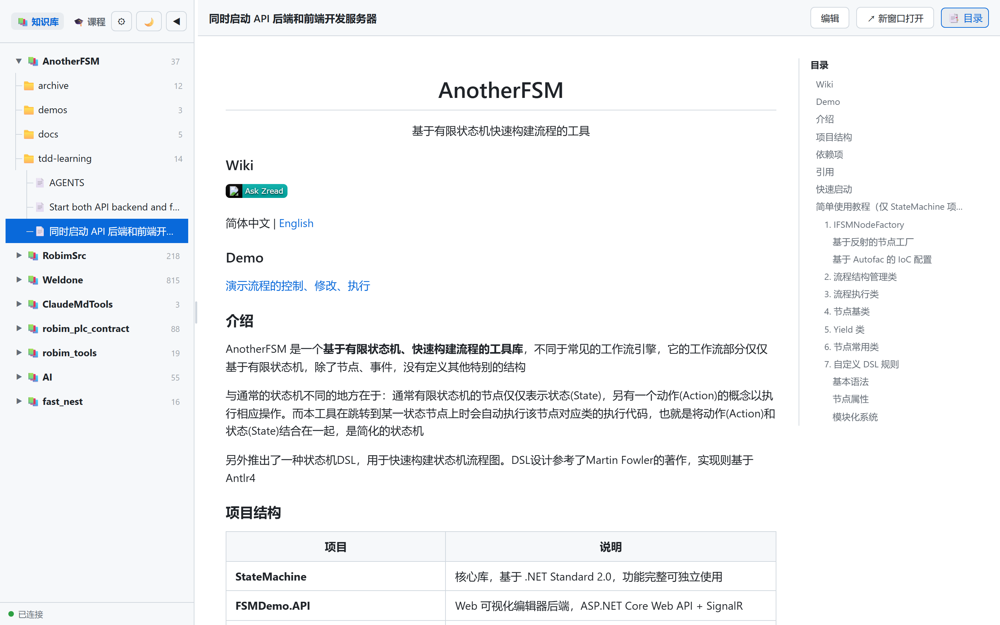
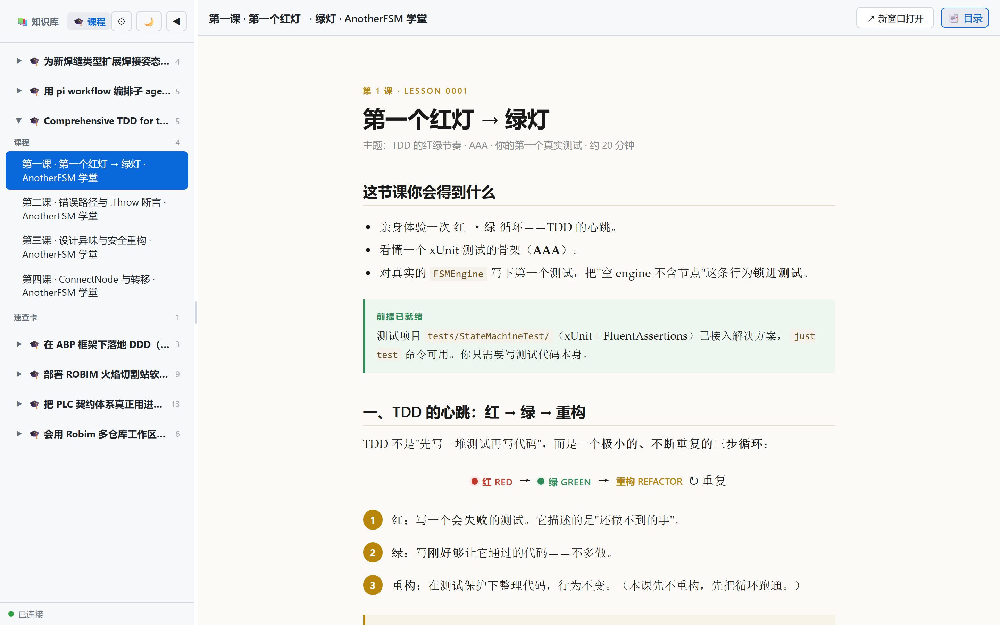

<div align="center">

# 📚 ClaudeMd Tools

**把散落在硬盘各处的 Markdown 笔记和 HTML 课程，装进一个浏览器标签页。**

文件保持原位 · 改动实时刷新 · 在线编辑写回 · AI 可直接 URL 访问


</div>

---

## 它解决什么问题

你的笔记散落在几十个项目文件夹里：这个仓库一份 `SPEC.md`，那个 workspace 一堆 `/teach` 生成的课程。想集中翻阅？只能一个个开文件，或者复制到一处——然后副本开始过期。

**ClaudeMd Tools 反着来**：文件一个都不动。你告诉它去哪些目录找，它负责扫描、分类、渲染。原文件改了，浏览器里下一秒就变。

```
C:/Work/weldone/openspec/specs/...   ─┐
C:/Work/AI/lessons/*.html            ─┼─►  localhost:8080  ─►  一个页面全看
C:/Work/notes/*.md                   ─┘    （原地读取 · 实时刷新）
```

## 长这样

**📚 知识库视图** — 左侧目录树，右侧 Markdown 渲染 + 目录导航（TOC）



**🎓 课程视图** — HTML 教学课程原样呈现



## ✨ 核心特性

### 📚 知识库视图 — Markdown / HTML 文档

- **树形目录浏览** — 按根目录展开项目结构，空文件夹自动隐藏，多层折叠
- **原地渲染** — Markdown 带目录（TOC）、代码高亮、Mermaid 图表；HTML 用 iframe 原样展示（css/js/图片相对路径照常工作）
- **在线编辑** — 浏览器里改，保存直接写回原始文件
- **实时刷新** — 文件一变，页面自动更新（chokidar 监听 + WebSocket 推送）
- **互联** — 文档间 `.md` 链接可点击跳转，浏览器前进/后退正常回溯

### 🎓 课程视图 — HTML 教学网页

- 自动识别含 `lessons/` 目录的 workspace，整个目录树托管（`lessons/` + `reference/` + `assets/`），课程间相对引用不断链
- 按 workspace 分组，课程 / 速查卡分类，可折叠

### 🤖 AI 友好（独有能力）

给 AI 一个 URL，它就能自己发现并读取你的全部文档：

```
GET /kb                          # 列出所有文档路径（纯文本）
GET /kb/weldone                  # 列出某项目的文档
GET /kb/weldone/openspec/...md   # 直接拿到 markdown 原文
```

在项目的 `CLAUDE.md` / `AGENTS.md` 里加一行指向 `http://localhost:8080/kb`，Claude Code 等工具即可自行检索知识库——无需 JSON 解析、无需参数。

## 🚀 快速开始

```bash
npm install
npm start
# 打开 http://localhost:8080
```

首次启动是空的——点右上角 **⚙** 添加根目录（如 `C:/Work`），立即生效。

> 端口默认 8080，`PORT=8090 npm start` 可改；PM2 部署时改 `ecosystem.config.cjs` 的 `env.PORT`。

## ⚙️ 配置根目录

两种方式，效果相同（配置写回文件、立即生效）：

**方式一：网页里点 ⚙** — 配置对话框实时预览每个根目录扫到多少文件，加错路径当场看到（✗ 不存在 / 0 个）。

**方式二：编辑配置文件** — 克隆后从模板复制：

```bash
cp knowledge.config.example.json knowledge.config.json   # 知识库
cp teach.config.example.json teach.config.json           # 课程
```

```jsonc
// knowledge.config.json
{
  "roots": ["C:/Work"],
  "excludeDirs": []   // 可选：额外排除的目录名，如 ["docs", "vendor"]
}

// teach.config.json
{ "roots": ["C:/Work/AI"] }
```

> 配置文件含本地路径，已在 `.gitignore` 中忽略，不会误提交。

**excludeDirs 说明**：目录名匹配（不区分大小写、不分层级），与内置排除列表（`node_modules`、`.git`、`dist` 等）合并生效。适合隐藏 `docs/`、`vendor/` 这类不想混入知识库的目录。注意它是全局的——对所有根目录生效；ClaudeMdTools 自身的 `docs/` 按绝对路径单独排除，不受影响。

## 🔁 常驻运行（PM2）

```bash
npm run pm2:start    # 启动（崩溃自动重启）
npm run pm2:stop     # 停止
npm run pm2:restart  # 重启
npm run pm2:logs     # 查看日志
npm run pm2:save     # 保存进程快照（开机恢复用）
```

详见 [DEPLOY.md](./DEPLOY.md)。

## 📡 API 参考

### 路径式 API（推荐 AI / 程序访问）

| 方法 | 路径 | 说明 |
|------|------|------|
| GET | `/kb` | 列出所有文档路径（纯文本） |
| GET | `/kb/<project>` | 列出某项目的文档路径 |
| GET | `/kb/<project>/<path>` | 返回 `.md` 原文（text/plain） |

### 知识库 JSON API

| 方法 | 路径 | 说明 |
|------|------|------|
| GET | `/api/knowledge` | 列出知识库文档（树形结构） |
| GET | `/api/knowledge/file` | 读取单个 .md 文件内容 |
| PUT | `/api/knowledge/file` | 保存编辑（写回原始文件） |
| GET | `/api/knowledge/view` | 渲染好的 HTML 页面（新窗口打开用） |
| GET/POST | `/api/knowledge/config` | 读取 / 更新配置（roots + excludeDirs） |
| POST | `/api/knowledge/preview` | 预览根目录扫描结果 |

### 课程 API

| 方法 | 路径 | 说明 |
|------|------|------|
| GET | `/api/courses` | 列出课程 workspace 及其课程/速查卡 |
| GET/POST | `/api/courses/config` | 读取 / 更新课程根目录配置 |
| POST | `/api/courses/preview` | 预览根目录扫描结果 |
| GET | `/teach/:wsId/*` | 托管课程 workspace 文件（HTML/CSS/JS） |

> 文件变化通过 WebSocket 推送 `knowledge-change` / `course-change` 事件，前端自动刷新。

## 🛠 技术栈

**后端** Express 5 · ws · chokidar · marked　**前端** 原生 HTML/CSS/JS · marked · highlight.js · mermaid.js　**部署** PM2

## 📁 项目结构

```
ClaudeMdTools/
├── server.js                       # Express + WebSocket 服务端
├── public/index.html               # 单页前端（知识库 / 课程 / 编辑 / 配置）
├── docs/img/                       # README 截图
├── ecosystem.config.cjs            # PM2 进程配置
├── knowledge.config.example.json   # 知识库配置模板
├── teach.config.example.json       # 课程配置模板
├── DEPLOY.md                       # 部署运维说明
└── package.json
```

## License

ISC
